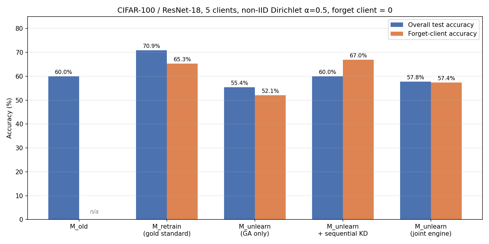

# Results (Phases 03–07)

This is a running summary of real experimental results, kept in sync with
`STATUS.md`. Every number here traces back to a committed file under
`artifacts/experiments/` — none are hand-typed without a source. See the
**Source** column in the table below, or `artifacts/experiments/comparison_table.csv`
(generated by `src/evaluation/comparison.py::build_comparison_table`).

**Setup:** CIFAR-100, ResNet-18, 5 federated clients, non-IID Dirichlet
partition (α=0.5), client 0 designated as the "forget client" throughout.

## Summary



| Model | Overall test acc. | Forget-client acc. | Cost | Source |
|---|---:|---:|---|---|
| M_old | 60.02% | n/a¹ | 20 rounds × 2 local epochs | `cifar100_fl/imported_metrics.json` |
| **M_retrain** (gold standard) | **70.89%** | **65.30%** | 50 rounds × 10 local epochs, FedProx μ=0.01 | `full_retraining/metrics.csv`, `forget_client_metrics.json` |
| M_unlearn (Gradient Ascent only) | 55.41% | 52.07% | 5 epochs on forget client only | `unlearning_ga_kd/gradient_ascent/metrics.json` |
| M_unlearn + sequential KD | 59.99% | 66.95% | + 5 epochs KD on remaining clients | `unlearning_ga_kd/knowledge_distillation/metrics.json` |
| **M_unlearn (joint GA+KD engine)** | **57.78%** | **57.36%** | 5 epochs joint, λ_forget=1.0, λ_kd=1.0 | `unlearning_ga_kd/engine/metrics.json` |

¹ `M_old`'s original training partition (the pre-refactor `main.py`) was
unseeded, so which samples belonged to "client 0" at training time can't be
reconstructed. All other rows use the same seeded partition
(`src/data/partition.py`, seed=42), so they're directly comparable to each
other.

## Phase-by-phase findings

### Phase 03/04 — Baselines

`M_retrain` (full retraining with client 0 excluded) beats `M_old` on both
axes — 70.89% vs. 60.02% overall, and a sensible 65.30% forget-client
accuracy (lower than overall, since it never trained on that client, but
not collapsed — non-IID clients share some class overlap).

This wasn't the first result: an earlier plain-FedAvg attempt scored only
31.86%/24.43%, diagnosed as FedAvg client drift from `local_epochs=10` on
non-IID data (see FedProx, Li et al., 2018). Fixed by adding a FedProx
proximal term (`mu=0.01`) plus momentum/weight decay — see
`phases/phase-04-full-retraining-baseline/PHASE.md` for the full story.

### Phase 05 — Gradient Ascent

Forgets client 0 far cheaper than full retraining (5 epochs on one client
vs. 50 rounds across four), but imprecisely: forget-client accuracy drops
15.0 points (67.10% → 52.07%) while overall test accuracy *also* drops 4.6
points (60.02% → 55.41%) — collateral damage to unrelated knowledge, the
textbook weakness of plain gradient ascent (it's an unbounded objective;
implementation required gradient clipping to avoid diverging to NaN).

### Phase 06 — Knowledge Distillation (sequential)

Standalone KD, run *after* Gradient Ascent as a separate stage, repairs
overall accuracy almost perfectly (55.41% → 59.99%, ~M_old level) — but
**also undoes almost all of the forgetting** (52.07% → 66.95%, back near
M_old's 67.10%). This is the key finding motivating Phase 07: KD's only
signal is "match the teacher (M_old) on remaining-client data," with no
instruction to preserve GA's forgetting effect, and non-IID class overlap
between clients means matching M_old's behavior on remaining data
indirectly restores behavior on overlapping forget-client classes too.

**This means the two objectives cannot be run as separate sequential
stages** — they need to be jointly optimized so both are balanced against
each other at every training step, not one completely overwriting the
other's effect afterward.

### Phase 07 — Unlearning Engine (joint GA+KD)

Per `docs/methodology.md`'s combined objective (`L_total = λ_forget · L_forget
+ λ_kd · L_KD`), `src/unlearning/engine.py::UnlearningEngine` trains one
student model with both losses computed jointly every step — not by
calling `GradientAscentUnlearner` then `KnowledgeDistiller` in sequence,
despite that being this phase's original scaffold wording (see that
file's PHASE.md handoff notes for why this was a deliberate, evidenced
deviation).

**First attempt had a real bug:** gradient clipping was applied to the
*combined* loss's gradient as one sum. Since the unbounded ascent term's
raw gradient magnitude is much larger than KD's bounded term, clipping the
sum still left the update direction dominated by forgetting regardless of
the nominal 1:1 λ weighting. Result: worse than plain GA on *both* axes
(50.00% test / 38.13% forget-client accuracy) — defeating the point of
adding KD at all.

**Fix:** backprop each loss separately and clip each gradient
independently *before* combining them into the parameter update (see
`_clip_grads_by_norm` in `engine.py`). Rerunning with the identical
hyperparameters produced the real, final result in the table above:
**57.78% test accuracy, 57.36% forget-client accuracy.**

This is a genuine middle ground, not a strict improvement over GA on both
axes — it trades some forgetting strength for much less collateral
damage: only −2.24 points of overall accuracy loss (vs. GA alone's
−4.61), while still meaningfully forgetting (−9.74 points on the forget
client, vs. sequential KD's essentially-zero −0.15 points). The
`training_history` in the committed `metrics.json` shows this directly:
`kd_loss` stayed nearly flat across epochs (0.105 → 0.123) with the fix,
versus nearly quadrupling (0.12 → 0.45) in the buggy version — direct
evidence the fix worked as diagnosed.

With equal λ weights, the joint method sits at one point on a real
precision-vs-cost tradeoff curve. A proper hyperparameter sweep over
λ_forget/λ_kd (not yet done — would benefit from more GPU time than a
single Colab session allows) would trace out that whole curve rather
than one point on it, and is the natural next step for strengthening
this result.

## Reproducing these numbers

```bash
python experiments/run_cifar100_fl.py --config configs/cifar100_fl.yaml        # M_old (only if not using the committed checkpoint)
python experiments/run_full_retraining.py                                      # M_retrain
python experiments/run_gradient_ascent.py                                      # M_unlearn (GA)
python experiments/run_knowledge_distillation.py                               # + sequential KD
python experiments/run_unlearning_engine.py                                    # M_unlearn (joint GA+KD, final)
```

`M_old`'s checkpoint (`artifacts/experiments/cifar100_fl/imported_original_model.pt`)
is committed directly to this repo rather than regenerated, since its
original training used an unseeded partition and can't be exactly
reproduced — see that file's directory for the caveat.
